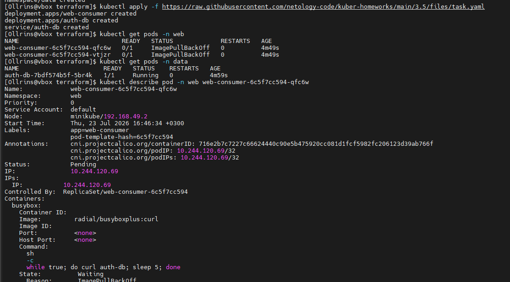
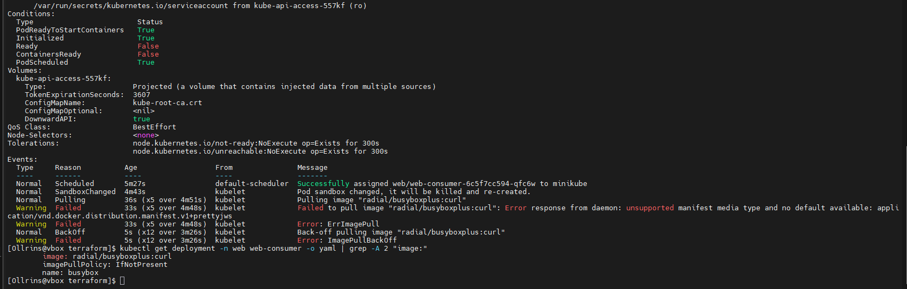
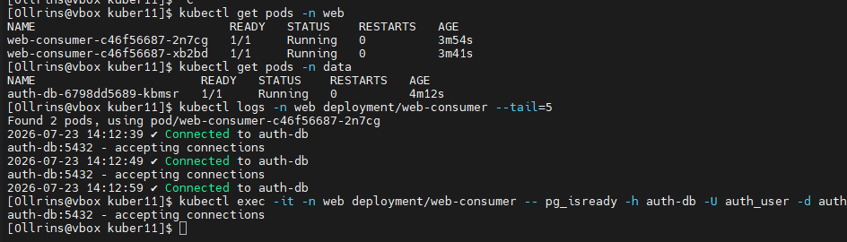

## Домашнее задание к занятию Troubleshooting

## Задание. Устранение неисправности при деплое приложения

#### Файлы манифестов
- [namespaces.yaml](namespaces.yaml)
- [auth-db-deployment.yaml](auth-db-deployment.yaml)
- [auth-db-service.yaml](auth-db-service.yaml)
- [auth-db-service-externalname.yaml](auth-db-service-externalname.yaml)
- [web-consumer-fixed.yaml](web-consumer-fixed.yaml)

### Описание проблемы

При деплое приложения `web-consumer` не может подключиться к `auth-db`.

**Основная причина:** приложение находится в неймспейсе `web` и использует короткое имя `auth-db`, которое не резолвится за пределами своего неймспейса, так как сервис `auth-db` развернут в неймспейсе `data`.

**Дополнительные проблемы:**
- Отсутствовали неймспейсы `web` и `data`
- Образ `radial/busyboxplus:curl` имеет неподдерживаемый тип манифеста (ImagePullBackOff)
- Использование `curl` для проверки PostgreSQL, который работает по TCP протоколу

### Решение

1. Созданы неймспейсы `web` и `data`
2. Образ `web-consumer` заменен на `postgres:13` с использованием `pg_isready` для проверки подключения
3. Создан сервис типа `ExternalName` в неймспейсе `web` для правильного DNS-резолвинга

#### Применение манифестов

```bash
kubectl apply -f namespaces.yaml
kubectl apply -f auth-db-deployment.yaml
kubectl apply -f auth-db-service.yaml
kubectl apply -f auth-db-service-externalname.yaml
kubectl apply -f web-consumer-fixed.yaml
```
Результат
До исправления:

<p align="center">  <br>  </p>
<p align="center">  <br>  </p>

После исправления:

```bash
kubectl get pods -n web
kubectl get pods -n data
kubectl logs -n web deployment/web-consumer --tail=5
kubectl exec -it -n web deployment/web-consumer -- pg_isready -h auth-db -U auth_user -d auth_db
```

<p align="center">  <br> <em>Рисунок 3 - Успешное подключение к auth-db (✓ Connected)</em> </p>

Вывод
Все проблемы устранены. Приложение web-consumer успешно подключается к auth-db.
